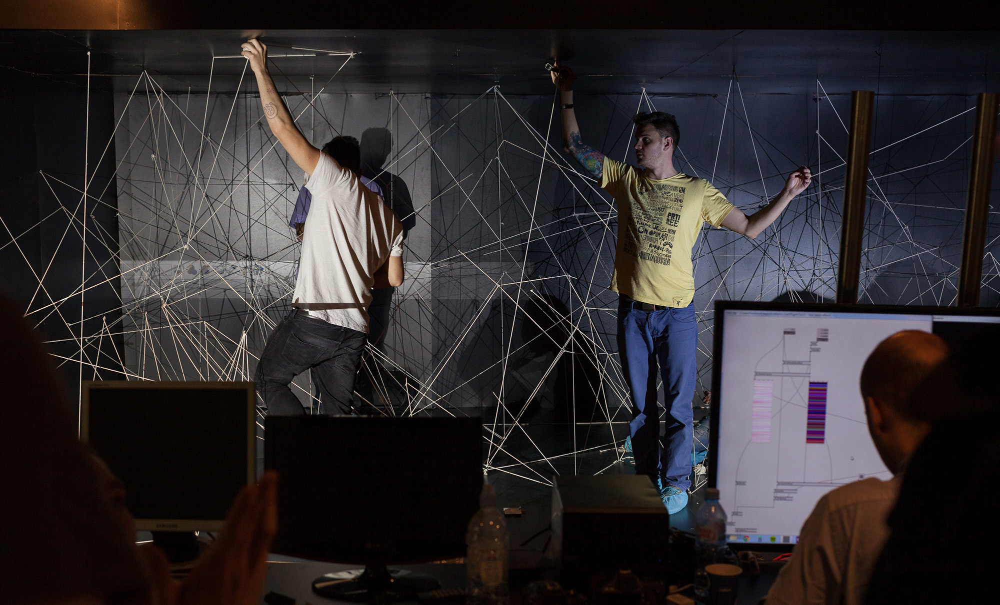

Digital Arts Circus
===================

Resonate Festival, Belgrade, April 2014

## 
They do not call themselves ‘artists’, but might be the future of art. We met the new-media art scene in Belgrade last week, at the Resonate festival.

Our reportage in english, french and german.

[http://resonate2014.jplusplus.org](http://resonate2014.jplusplus.org) EN  
[http://resonate2014.jplusplus.org/fr.html](http://resonate2014.jplusplus.org/fr.html) FR  
[http://resonate2014.jplusplus.org/de.html](http://resonate2014.jplusplus.org/de.html) DE  

By [Anne-Lise Bouyer](https://twitter.com/annelisebouyer), [Sebastian Kraus](https://twitter.com/sm_kraus) et [Edouard Richard](https://twitter.com/vied12) for [Journalism++](http://jplusplus.org/)  
CC-BY-SA Journalism++ SAS ⁞ Photos © Resonate.
## Installation

### Dependances

	$ sudo apt-get install build-essential python-pip python-dev

and install virtualenv

	$ sudo pip install virtualenv

Please also install [CoffeeScript](http://coffeescript.org/)

### Setup a virtualenv and download dependances

	$ make install

### Run the server

	$ make run

### Locales

	$ make update_i18n
	$ make compile_i18n

### Compile the static files

	$ make freeze

### Launch

	$ make run
